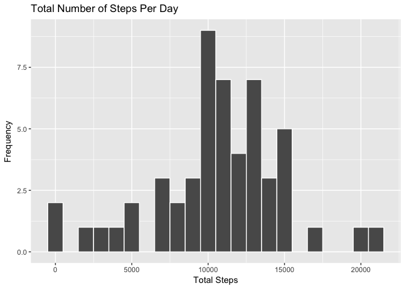
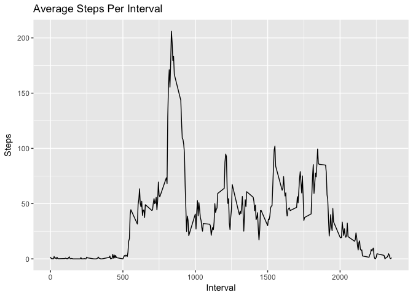
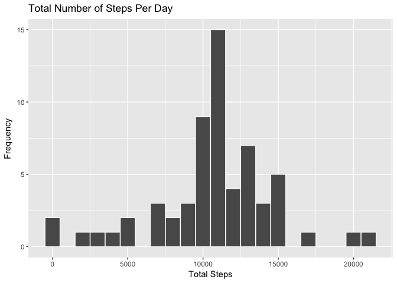
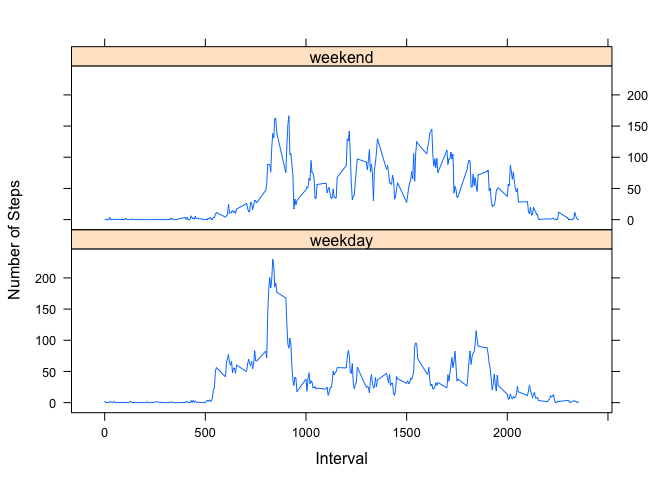

## Load necessary packages

```r
library(ggplot2)
library(lattice)
```

## Loading and preprocessing the data
The data is unzipped and loaded using `read.csv()`    

```r
# Load and preprocess data
unzip("activity.zip")
activity <- read.csv("activity.csv", header = TRUE)
activity$date <- as.Date(activity$date, "%Y-%m-%d")
```


## What is mean total number of steps taken per day?
For this part of the assignment, you can ignore the missing values in the dataset.  

1. Calculate the total number of steps taken per day 

```r
per.day <- aggregate(. ~ date, data = activity, sum, na.rm = TRUE)
```


2. Make a histogram of the total number of steps taken each day  

```r
ggplot(data = per.day, aes(x = steps)) + geom_histogram(binwidth = 1000, color = "white") + labs(title = "Total Number of Steps Per Day", x = "Total Steps", y = "Frequency")
```

<!-- -->


3. Calculate and report the mean and median of the total number of steps taken per day 

```r
mean.steps <- mean(per.day$steps, na.rm = TRUE)
median.steps <- median(per.day$steps, na.rm = TRUE)
```

```r
mean.steps
```

```
## [1] 10766.19
```

```r
median.steps
```

```
## [1] 10765
```


## What is the average daily activity pattern?
1. Make a time series plot of the 5-minute interval (x-axis) and the average number of steps taken, averaged across all days (y-axis)  

```r
# Calculate average steps per interval
avg <- aggregate(. ~ interval, data = activity, mean, na.rm = TRUE)

# Create plot of average steps per interval
ggplot(data = avg, aes(x = interval, y = steps)) + geom_line() + labs(title = "Average Steps Per Interval", x = "Interval", y = "Steps")
```

<!-- -->


2. Which 5-minute interval, on average across all the days in the dataset, contains the maximum number of steps?

```r
avg[avg$steps == max(avg$steps), 1]
```

```
## [1] 835
```


## Imputing missing values
1. Calculate and report the total number of missing values in the dataset

```r
sum(is.na(activity$steps))
```

```
## [1] 2304
```

2. Devise a strategy for filling in all of the missing values in the dataset. The strategy does not need to be sophisticated. For example, you could use the mean/median for that day, or the mean for that 5-minute interval, etc. 

3. Create a new dataset that is equal to the original dataset but with the missing data filled in. 

*The missing values will be filled in based on the average of that interval.*


```r
# Create copy of original data
activity.impute <- activity

# Get NAs
nas <- is.na(activity.impute$steps)

# Calculate average steps by interval
avg.int <- tapply(activity.impute$steps, activity.impute$interval, mean, na.rm = TRUE)

# Replace NAs with average steps by interval
activity.impute$steps[nas] <- avg.int[as.character(activity.impute$interval[nas])]
```


4. Make a histogram of the total number of steps taken each day.

```r
new.per.day <- aggregate(. ~ date, data = activity.impute, sum)
ggplot(data = new.per.day, aes(x = steps)) + geom_histogram(binwidth = 1000, color = "white") + labs(title = "Total Number of Steps Per Day", x = "Total Steps", y = "Frequency")
```

<!-- -->


Calculate and report the mean and median total number of steps taken per day.

```r
new.mean <- mean(new.per.day$steps)
new.median <- median(new.per.day$steps)
```


```r
new.mean
```

```
## [1] 10766.19
```

```r
new.median
```

```
## [1] 10766.19
```

Do these values differ from the estimates from the first part of the assignment? What is the impact of imputing missing data on the estimates of the total daily number of steps?  
  
*The mean stays the same and the median slightly changes. The mean and median are now equal. This is likely due to using the mean of intervals for the missing data.* 


## Are there differences in activity patterns between weekdays and weekends?
1. Create a new factor variable in the dataset with two levels – “weekday” and “weekend” indicating whether a given date is a weekday or weekend day.

```r
# Create new variable indicating weekday or weekend
activity.impute$weekday <- ifelse(weekdays(activity.impute$date) == "Saturday" | weekdays(activity.impute$date) == "Sunday", "weekend", "weekday")

# Convert new variable to factor
activity.impute$weekday <- factor(activity.impute$weekday)
```


2. Make a panel plot containing a time series plot of the 5-minute interval (x-axis) and the average number of steps taken, averaged across all weekday days or weekend days (y-axis).

```r
# Calculate average number of steps per interval
new.avg <- aggregate(steps ~ interval+weekday, data = activity.impute, mean)

# Plot data
xyplot(steps ~ interval | weekday, new.avg, layout=c(1,2), type="l", ylab = "Number of Steps", xlab = "Interval")
```

<!-- -->

*It looks like the test subject is more active throughout the day on weekends most likely due to working on the weekdays.*
